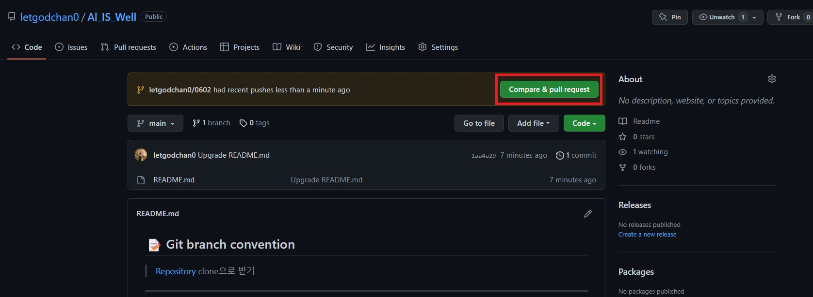
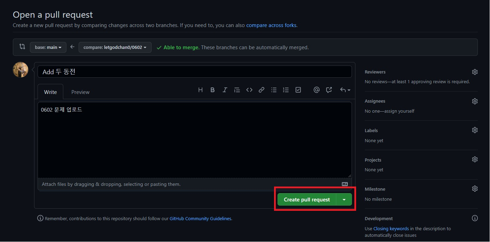

## 📝 Git branch convention

> [Repository](https://github.com/letgodchan0/Al_IS_Well.git) clone으로 받기

<hr>
<br>

> 문제 업로드 전 브랜치 생성 및 이동


```bash
# 브랜치 만들면서 이동
$ git switch -c letgodchan0/0602

# 현재 브랜치 확인
$ git branch
```

<br>

> 문제 풀기 완료 후 각자 이름으로 폴더 생성 후 커밋, 푸쉬

```bash
ex) 1주차/0602/찬영/

# 각자 폴더에 문제 올라가 있는지 확인
$ git status

# add
$ git add .

# 커밋
$ git commit -m "Add 문제 이름"			// 오타거나 재업로드일 경우 "Set 문제이름"

# 푸쉬
$ git push origin letgodchan0/0602
```


<br>

> GitHub에서 내가 푸쉬한 내용 `pull request` 하기





<br>

> 팀장이 merge 하면 프로젝트의 변경사항이 반영되어 있음, 이후 로컬에 돌와와서 main 브랜치로 이동 후 반영

```bash
# 브랜치 변경
$ git switch master

# GitHub에서 프로젝트 변경사항 반영하기
$ git pull origin master
```

<br>

> 로컬에 `pull` 하면서 프로젝트 변경사항이 반영이 되었음, 이제 기존의 사용했던 브랜치 삭세

```bash
$ git branch -d letgodchan0/0602

# main과 관계 없이 강제로 삭제하려면 
$ git branch -D letgodchan0/0602
```

